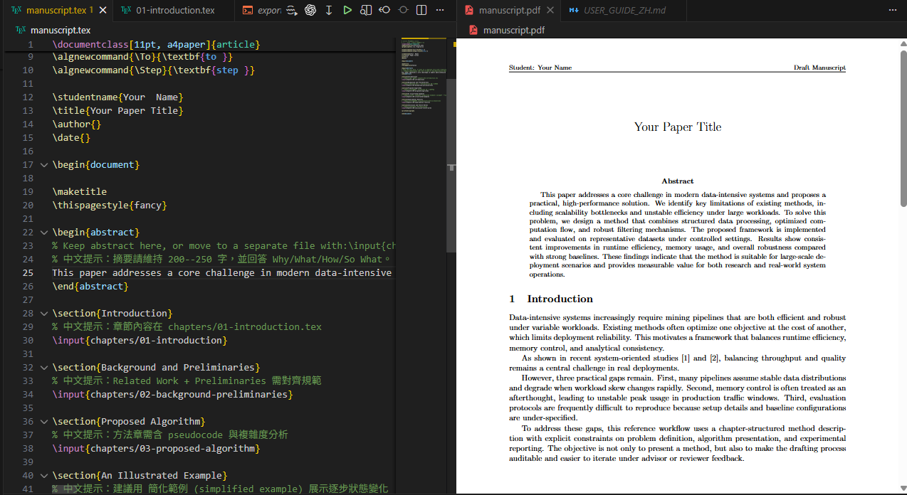

# sdd-thesis-kit


基於規格、分章式的 LaTeX 論文草稿撰寫工具組。


## 儲存庫目的 (Repository Purpose)

本儲存庫提供：

* 一套分章式的 LaTeX 寫作流程
* 位於 `specs/` 下的明確寫作規範
* 可重複使用的模板與範例
* 用於單一檔案投稿的匯出工具

## 環境設定 (Environment Setup)

### 1) 安裝 TeX 環境

* Windows: 安裝 MiKTeX
* macOS: 安裝 MacTeX (或 BasicTeX + 所需套件)

### 2) 驗證指令

Windows:

```bash
where pdflatex
where bibtex
where latexmk

```

macOS/Linux:

```bash
which pdflatex
which bibtex
which latexmk

```

### 3) VS Code (推薦)

* 安裝擴充功能：`LaTeX Workshop`
* 開啟本儲存庫資料夾（請勿只開啟單一檔案）
* 本儲存庫已於 `.vscode/settings*.json` 中啟用「存檔時自動編譯」功能
* **注意：目前主要在 Windows 環境驗證，macOS 尚未完整測試，可能出現路徑或工具設定問題**
* macOS 使用者請先執行 `./switch-vscode-env.sh mac`，再在 VS Code 執行 `Developer: Reload Window`

### 4) 建置指令 (Build commands)

Windows:

```bash
build.bat manuscript.tex

```

跨平台手動指令：

```bash
pdflatex manuscript.tex
bibtex manuscript
pdflatex manuscript.tex
pdflatex manuscript.tex

```

## 專案結構 (Project Structure)

* `manuscript.tex`: 主要手稿入口檔案
* `chapters/`: 實際章節內容檔案
* `specs/rules/writing-constraints.md`: 標準寫作規則
* `specs/thesis-draft/tasks.md`: 執行 + 合規檢查表
* `examples/chapter_reference_main.tex`: 完整的分章式參考範例
* `examples/chapters/`: 各章節參考範例
* `templates/chapters/`: 可重複使用的章節起始模板
* `scripts/`: 自動化腳本
* `scripts/export-single.ps1`: 將 `\input{...}` 展開為單一 `.tex` 檔
* `export-single.bat`: 用於單檔匯出的 Windows 包裝器 (wrapper)
* `wmt-template.sty`: 套件/樣式整合檔
* `references.bib`: 參考文獻條目（投稿前請替換範例條目）

## 如何使用模板與腳本 (How To Use Templates and Scripts)

### 模板 (`templates/`)

當你需要快速建立章節草稿架構時，請使用模板。

1. 開啟 `templates/chapters/` 下的模板檔案
2. 將其內容複製到 `chapters/` 對應的檔案中
3. 將佔位符替換為你的實際內容

常見對應關係：

* `templates/chapters/01-introduction.template.tex` -> `chapters/01-introduction.tex`
* `templates/chapters/02-background-preliminaries.template.tex` -> `chapters/02-background-preliminaries.tex`
* `templates/chapters/03-proposed-algorithm.template.tex` -> `chapters/03-proposed-algorithm.tex`

### 腳本 (`scripts/`)

當你需要自動化（而非手動複製/貼上）時，請使用腳本。

* 將分章式手稿匯出為單一 `.tex` 檔案：

```bash
export-single.bat manuscript.tex manuscript_single.tex

```

* 直接使用 PowerShell：

```bash
powershell -NoProfile -ExecutionPolicy Bypass -File scripts/export-single.ps1 -Source manuscript.tex -Output manuscript_single.tex

```

## 使用者寫作手冊 (User Writing Manual)

有關實際寫作步驟與流程，請參閱：[使用者指南 (USER_GUIDE_ZH.md)](USER_GUIDE_ZH.md)
